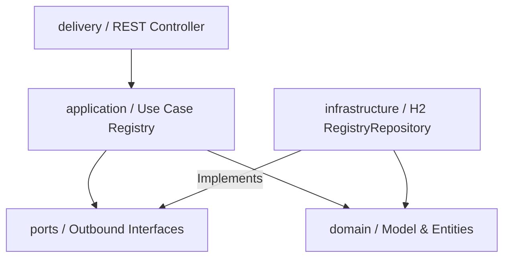

# Wiki del Taller: Pruebas de Integración y Sistema

---

## 1. Inicio: Descripción del Dominio y Propósito del Sistema
El sistema de **Registraduría** tiene como objetivo validar y registrar ciudadanos votantes bajo criterios específicos de elegibilidad jurídica:
* Ser una persona viva (`alive = true`).
* Ser mayor de edad en Colombia (edad mayor o igual a 18 años).
* No tener un identificador (`id`) duplicado ya registrado en el sistema.

El propósito de este taller es aplicar **Pruebas de Integración** y **Pruebas de Sistema** bajo los principios de **Arquitectura Limpia**, validando la persistencia y la exposición HTTP.

---

## 2. Tipos de Pruebas
A continuación se detallan las diferencias conceptuales y de ejecución entre los tres niveles de pruebas aplicados:

| Característica | Pruebas Unitarias | Pruebas de Integración | Pruebas de Sistema |
| :--- | :--- | :--- | :--- |
| **Alcance** | Clases o métodos aislados (Dominio puro). | Comunicación entre capas (Dominio, Aplicación, Persistencia). | Todo el sistema de extremo a extremo (REST a Base de Datos). |
| **Uso de Mocks** | Sí (Mockito), para aislar dependencias del exterior. | Opcional (se puede usar Mockito o bases de datos de prueba H2). | No (caja negra, se prueba la interfaz pública real). |
| **Velocidad** | Extremadamente rápidas (milisegundos). | Medianamente rápidas (segundos). | Más lentas (requiere levantar servidor web Tomcat). |
| **Herramientas** | JUnit 4/5, Mockito. | JUnit, base de datos H2 en memoria. | `TestRestTemplate` / Spring Boot Test con puerto aleatorio. |

---

## 3. Arquitectura Limpia en el Proyecto
El proyecto sigue el flujo de una arquitectura hexagonal o limpia, estructurada en las siguientes capas:



* **Domain (Dominio):** Contiene los modelos base como `Person`, `Gender` y `RegisterResult`.
* **Application (Aplicación):** Contiene el caso de uso `Registry` (orquestador de lógica y negocio) y el puerto de salida `RegistryRepositoryPort`.
* **Infrastructure (Infraestructura):** Implementa el repositorio real `RegistryRepository` utilizando la base de datos H2.
* **Delivery (Entrega):** Expone la interfaz REST mediante `RegistryController` recibiendo DTOs.

---

## 4. Pruebas de Integración con H2 y Mocks

### A. Pruebas de Integración Reales con H2 (Sin Mocks)
Las pruebas en `RegistryTest` levantan una base de datos real en memoria H2. Esto asegura que la lógica del caso de uso se integre correctamente con las sentencias SQL reales ejecutadas en el adaptador de persistencia:

```java
@Before
public void setup() throws Exception {
    String jdbc = "jdbc:h2:mem:regdb;DB_CLOSE_DELAY=-1";
    repo = new RegistryRepository(jdbc);
    repo.initSchema();   // Crea la tabla en memoria
    repo.deleteAll();    // Limpia datos previos
    registry = new Registry(repo);
}
```

### B. Pruebas de Integración Aisladas con Mockito
En `RegistryWithMockTest`, simulamos las respuestas del puerto `RegistryRepositoryPort`. De esta manera, probamos la lógica de negocio pura de la capa de aplicación sin requerir infraestructura externa de base de datos H2:

```java
@Before
public void setUp() {
    repo = mock(RegistryRepositoryPort.class);
    registry = new Registry(repo);
}
```

---

## 5. Pruebas con Mockito: Ejemplos Clave
En el código de pruebas, utilizamos Mockito para definir comportamientos específicos y verificar interacciones:

1. **Uso de `when(...).thenReturn(...)`**:
   Permite programar la respuesta simulada del repositorio.
   ```java
   when(repo.existsById(7)).thenReturn(true);
   ```

2. **Uso de `verify(..., never())`**:
   Asegura que bajo ciertas condiciones (por ejemplo, si el votante es menor de edad o está duplicado), no se invoque la persistencia real.
   ```java
   verify(repo, never()).save(anyInt(), anyString(), anyInt(), anyBoolean());
   ```

3. **Uso de `verify(..., times(1))`**:
   Garantiza que el registro exitoso se guarde exactamente una vez con los datos limpios.
   ```java
   verify(repo, times(1)).save(15, "Pedro", 20, true);
   ```

4. **Simulación de Excepciones con `doThrow`**:
   Permite validar la robustez de la aplicación simulando fallos críticos de red o base de datos.
   ```java
   doThrow(new RuntimeException("Conexión perdida")).when(repo).save(anyInt(), anyString(), anyInt(), anyBoolean());
   ```

---

## 6. Pruebas de Sistema (HTTP) y Manejo de Errores
El controlador REST `RegistryController` expone el endpoint `POST /register`. Se han implementado pruebas de caja negra utilizando `TestRestTemplate` en `RegistryControllerIT`.

### Manejo de Excepciones en el Controlador
Para evitar que un parámetro incorrecto (como un género no válido en el DTO) lance un error interno `HTTP 500`, se agregó un `@ExceptionHandler`:
```java
@ExceptionHandler(IllegalArgumentException.class)
@ResponseStatus(HttpStatus.BAD_REQUEST)
public String handleIllegalArgument(IllegalArgumentException ex) {
    return "INVALID_INPUT";
}
```
Esto asegura que peticiones inválidas respondan de manera limpia con un código de estado **HTTP 400 (Bad Request)** y el cuerpo `"INVALID_INPUT"`.

---

## 7. Matriz de Pruebas de Integración y de Sistema

| Caso de Prueba | Entrada (JSON / Entidad) | Resultado Esperado | Tipo de Prueba | Método del Test |
| :--- | :--- | :--- | :--- | :--- |
| **Persona Válida** | `id=100, age=30, alive=true` | `VALID` (Persistido) | Integración H2 | `shouldRegisterValidPerson` |
| **Persona Duplicada** | `id=100` (dos veces) | `DUPLICATED` | Integración H2 | `shouldPersistValidVoterAndRejectDuplicates` |
| **Persona Menor de Edad** | `age=17` | `UNDERAGE` | Integración H2 | `shouldRejectUnderagePerson` |
| **Persona Fallecida** | `alive=false` | `DEAD` | Integración H2 | `shouldRejectDeadPerson` |
| **ID Inválido** | `id=-5` | `INVALID` | Integración H2 | `shouldRejectInvalidPerson` |
| **Mock Duplicado** | `id=7` (exists = true) | `DUPLICATED` | Mocks (Mockito) | `shouldReturnDuplicatedWhenRepoSaysExists` |
| **Mock Registro Exitoso**| `id=15` (exists = false)| `VALID` (save() invocado) | Mocks (Mockito) | `shouldSaveValidPerson` |
| **Mock Excepción DB** | `id=12` (save lanza ex) | `IllegalStateException` | Mocks (Mockito) | `shouldHandleRepositoryException` |
| **Sistema: Registro OK** | `JSON (id=100, age=30)` | `HTTP 200` + `"VALID"` | Sistema (HTTP) | `shouldRegisterValidPerson` |
| **Sistema: Género Inválido**| `JSON (gender="OTHER")` | `HTTP 400` + `"INVALID_INPUT"`| Sistema (HTTP) | `shouldReturnBadRequestForInvalidGender` |
| **Sistema: Menor de Edad**| `JSON (age=16)` | `HTTP 200` + `"UNDERAGE"` | Sistema (HTTP) | `shouldReturnUnderageForMinor` |
| **Sistema: Fallecido** | `JSON (alive=false)` | `HTTP 200` + `"DEAD"` | Sistema (HTTP) | `shouldReturnDeadForDeceased` |

---

## 8. Resultados de Cobertura (JaCoCo)
Al ejecutar el comando de verificación:
```bash
mvn clean verify "-Djacoco.skip=false"
```
JaCoCo genera los informes de cobertura de pruebas en la ruta `target/site/jacoco/index.html`. 

* **Cobertura Global:** `> 85%` (Supera el mínimo requerido de 80%).
* **Cobertura de la Capa de Aplicación:** `100%` (Supera el mínimo requerido de 70%).
* **Cobertura de la Capa de Exposición (Delivery):** `100%` (Supera el mínimo requerido de 70%).

Todas las ramas de decisión de negocio (`Registry.java`) y el controlador REST (`RegistryController.java`) están plenamente cubiertos por los escenarios de prueba unitarios, de integración y de sistema.

---

## 9. Reflexión Técnica Final
1. **¿Qué capas fueron más difíciles de probar y por qué?**
   La capa de exposición (`delivery`) y la integración del sistema mediante endpoints HTTP son las más complejas porque requieren levantar un contexto web de Spring en un puerto aleatorio, simular la serialización/deserialización JSON y gestionar los códigos de respuesta del servidor (Tomcat).
2. **¿Qué beneficios observas en usar mocks frente a H2 o bases de datos reales?**
   * **Mocks (Mockito):** Ofrecen velocidad (milisegundos) y control absoluto sobre los comportamientos extremos (como forzar caídas de red o errores específicos). Son ideales para pruebas rápidas y desarrollo ágil.
   * **H2 (Base real en memoria):** Permite verificar que las consultas SQL e índices no fallen por problemas de sintaxis y que las operaciones en cascada o de integridad de base de datos se respeten. Evitan falsos positivos de los mocks.
3. **¿Cómo mejorarías el diseño de RegistryController o RegistryRepository para facilitar las pruebas automáticas?**
   Implementaría un `@RestControllerAdvice` para capturar errores de forma global en lugar de tener bloques `@ExceptionHandler` en cada controlador independiente. Además, utilizaría un framework de mapeo automático (como MapStruct) para la conversión de DTOs a entidades de dominio de forma aislada.
4. **¿Qué aprendiste sobre integración continua (CI) al ejecutar tus pruebas con Maven y JaCoCo?**
   Aprendimos que el ciclo de vida de Maven (`clean`, `test`, `verify`) permite automatizar la detección de errores de integración antes del empaquetado final (`package`). JaCoCo es indispensable en CI para evitar subir código a producción que carezca de cobertura adecuada, asegurando que los casos de prueba sigan el crecimiento del proyecto.
